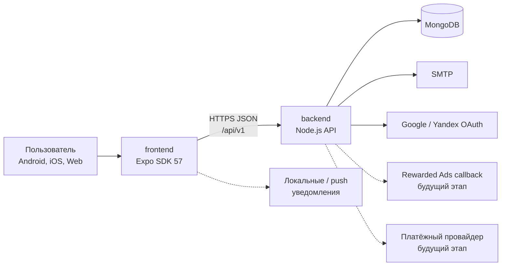
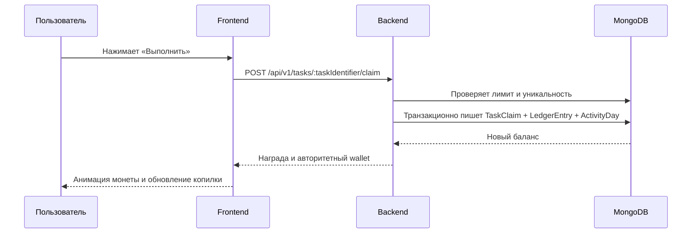

# Архитектура Logic Coin

## Цели

Архитектура разделяет интерфейс и доверенную бизнес-логику, сохраняет единую
Expo-кодовую базу для Android/iOS/Web и оставляет понятные точки расширения для
rewarded ads, push-уведомлений, платёжного провайдера и антифрода. Исходники
frontend и backend находятся в разных workspace-папках; web и API при этом
публикуются одним Vercel-проектом.

## Контекст системы

Сплошные связи относятся к базовой интеграции MVP, пунктирные — к production-расширениям. Доступность конкретного OAuth-провайдера зависит от настроенных redirect URI и ключей окружения.

## Границы репозитория

### `frontend`

Expo SDK 57 + React Native + TypeScript. Один UI адаптируется к телефону и web. Внутри frontend должны быть разделены:

- presentation: экраны, навигация, темы и анимации;
- features: auth, tasks, wallet, bonuses, profile, referrals, withdrawal;
- data: API client, query cache, secure/local persistence;
- domain: типы и чистые правила отображения;
- platform adapters: уведомления, haptics, secure storage, будущая реклама.

Frontend отвечает за UX, оптимистичные анимации и локальные предпочтения, но не определяет окончательный баланс и право на вывод.

### `backend`

Node.js + TypeScript API. Ответственность backend:

- регистрация, подтверждение email и OAuth;
- авторизация запросов;
- профиль, настройки и активность;
- каталог заданий и атомарное начисление награды;
- streak/bonus rules;
- серверный wallet/ledger;
- referrals;
- проверка порога и создание заявки на вывод;
- интеграции MongoDB/SMTP/OAuth;
- rate limit, validation, request IDs и единая обработка ошибок.

### MongoDB

Текущие модели данных:

- `User` — identity, OAuth providers, profile, preferences, referral relation и
  агрегированный wallet;
- `OtpChallenge` — хеш email-кода, TTL, attempts и отметка потребления;
- `RefreshSession` — refresh-family, rotation, абсолютный срок жизни и отзыв;
- `OAuthChallenge` — одноразовый Yandex state/PKCE challenge;
- `Task` и `TaskClaim` — каталог, reward policy, дневные лимиты и idempotency;
- `LedgerEntry` — серверный журнал операций кошелька;
- `ActivityDay` и `BonusClaim` — календарная активность и бонусы;
- `Withdrawal` — sandbox-заявки и история статусов;
- `Device` — настройки уведомлений и безопасное хранение push token;
- `RateLimitCounter` — распределённые production rate limits.

Внешний API не зависит от формы MongoDB-документов и возвращает только
сериализованные представления.

## Ключевые потоки

### Выполнение задания в MVP

В MVP рекламного шага нет. Будущий adapter получает подтверждение rewarded ad, а backend принимает подписанный callback/verification token до записи ledger. Клиентское событие «реклама просмотрена» не является достаточным доказательством.

### Email-регистрация

1. `POST /auth/register` нормализует email, применяет rate limit, создаёт
   одноразовый email-код и отдельный `registrationToken`.
2. В базе хранятся только хеш кода и хеш registration token. Код имеет
   настраиваемый короткий TTL; registration token действует не более 24 часов.
3. SMTP отправляет код, а одноразовый registration token возвращается клиенту
   только в ответе `/register`.
4. `POST /auth/email/verify` требует одновременно email, код и
   `registrationToken`, атомарно потребляет OTP, удаляет registration token,
   активирует аккаунт и выдаёт access/refresh session.
5. Повторный `/register` незавершённого аккаунта меняет пароль и token; старый
   token сразу становится недействительным. `/auth/email/resend` меняет только
   OTP.

### Ежедневная активность

Календарный день вычисляется по сохранённой timezone пользователя. Уникальные
task/bonus claims защищены от повторного начисления, а явный
`POST /activity/check-in` увеличивает `actionCount` при каждом принятом запросе.
Grace-streak допускает один пропущенный календарный день в каждой ISO-неделе;
расчёт покрывается тестами. Клиент планирует ежедневное локальное напоминание,
только если пользователь дал разрешение и включил уведомления. Для
гарантированных удалённых push позднее добавляется scheduler.

### Вывод

Backend читает server-authoritative wallet, проверяет минимальный порог
`MIN_WITHDRAWAL_CENTS` (по умолчанию 10 USD) и создаёт только sandbox-заявку со
статусом `sandbox_pending`. Сумма транзакционно переносится из available в
locked, но деньги никуда не отправляются. Production worker должен отдельно
провести antifraud/KYC и инициировать платёж идемпотентно; webhook провайдера
будет менять статус только после проверки подписи.

## Доверие и консистентность

- Все денежные суммы передаются в integer minor units либо в строго определённых coin units, не в floating point.
- Баланс и reward определяет сервер.
- Изменяющие wallet операции имеют idempotency key или естественный уникальный ключ.
- Запись completion и ledger выполняется транзакционно либо через схему, исключающую двойное начисление.
- Даты API — ISO 8601 UTC; дневные границы рассчитываются по IANA timezone.
- Клиент сбрасывает/изолирует query cache при выходе пользователя.
- Ошибки имеют стабильный `code`, пригодный для локализации на клиенте.

Подробные HTTP-формы приведены в [api.md](api.md).

## Конфигурация

Frontend получает только публичную конфигурацию сборки:
`EXPO_PUBLIC_API_URL` и публичный Google client ID. Web по умолчанию использует
same-origin `/api/v1`; APK получает production HTTPS URL через GitHub Variable.

Backend получает MongoDB, SMTP, OAuth secrets, JWT/OTP secrets, CORS allowlist и
экономические параметры через окружение. В production `JWT_SECRET` и
`OTP_PEPPER` обязательны и должны содержать не менее 32 символов. Фактические
имена перечислены в `backend/.env.example`. Текущий demo task provider и sandbox
withdrawals зафиксированы в бизнес-логике; несуществующие `ADS_MODE` или
`WITHDRAWALS_MODE` не следует добавлять в конфигурацию.

## Развёртывание

Используется один Vercel-проект с Root Directory в корне репозитория:

- root `vercel.json` собирает web-export в `frontend/dist`;
- `api/index.ts` экспортирует Express backend как Vercel Function;
- rewrite `/api/*` передаёт запросы backend, а SPA rewrite обслуживает остальные
  маршруты;
- Vercel URL используется для same-origin API, CORS и OAuth defaults, если
  соответствующие значения не заданы явно.

APK собирается из той же frontend-версии отдельным GitHub Actions workflow.
Каталоги `frontend/android` и `frontend/ios` генерируются `expo prebuild` в CI и
не являются исходным кодом. Release APK подписывается постоянным PKCS#12
keystore из GitHub Secrets; публичный production API URL передаётся через
GitHub Variable.

## Эволюция после MVP

1. Добавить административный reconciliation и операционные инструменты поверх
   существующего ledger.
2. Подключить server-side verification rewarded ads и заменить demo claim до
   включения монетизации.
3. Добавить push token registry и планировщик напоминаний.
4. Добавить antifraud signals, observability и audit trail.
5. Подключить KYC/платёжного провайдера через отдельный worker.
6. При росте нагрузки вынести reward/withdrawal обработку в очередь, сохранив REST-контракт.
